# /slant api README

## Table of Contents

1. [Introduction](#introduction)
2. [Links](#links)
3. [Database & Structure](#database--structure)
    - [ERD](#erd)
4. [Testing](#testing)
    - [Unit Testing](#unit-testing)
    - [Validators](#validators)
    - [Manual Testing](#manual-testing)
    - [CRUD](#crud)
5. [Bugs](#bugs)
6. [Deployment](#deployment)
7. [Technologies Used](#technologies-used)
8. [Credits and Acknowledgements](#credits--acknowledgements)

## Introduction

*NB - This repository is the backend API for Portfolio Project 5 of Code Institute's full stack development course. Please see the link section below for navigation to the front end application and project board.*

Modern current affair news media is a minefield. There are so many sources and articles competing for your attention, pulling you this way and that, ensuring that most people will end up in their own ‘bubble’ – a place where they only consume stories that are algorithmically tailored to them.

slant does things differently.

slant is a totally objective repository of journalistic articles where users can submit and share pieces – either written independently or from one of the major outlets – and comment, favourite and share their favourites. 

However, this is not all – each submission to slant is ranked by bias according to the slant users. This numerical rating is displayed on each of the articles, and allows users to form an opinion before reading that they can then examine after seeing the article themselves. 

Most of all, the idea behind slant is to take the **noise** out of online news reading. No ads, no distractions, just stories that matter to you and a safe space to cross-examine and discuss.

slant aims to break the news media wheel of doom and expand the horizons of it’s users, and provide a website where the bias of a story is voted on by the users of the website – allowing each and every user to examine journalistic prejudices and begin to examine the media from a Critical stance, with each piece of content receiving ratings based on user inputs.

slant created using **React** and **Django REST framework**, and is my PP5 submission for Code Institute Advanced Front End.

## Links

- [Deployed API](https://slantapi-c636400a6ffd.herokuapp.com/)
- [slant Frontend](https://github.com/AlbaXIII/slant)
- [Project Kanban Board](https://github.com/users/AlbaXIII/projects/11)

## User Stories & Methodology

The main user stories for slant, both backend and frontend, were collated into a github [Kanban Board](https://github.com/users/AlbaXIII/projects/11) for convenience and consistency across the project. The user stories for both ends of the stack have followed the MoSCoW methodology – separating features into **must-have**, **should-have**, **could-have** and **won’t-have**.

Furthermore, each grouping of user stories had it’s own corresponding EPIC;

- EPIC 1 – database setup

- EPIC 2 – article model

- EPIC 3 – comment model

- EPIC 4 – rating model

- EPIC 5 – profile model

- EPIC 6 – deployment

The total list of user stories noted in the Kanban board are listed below, organised into their respective EPIC & MoSCoW categories.

The following user stories were created for slant-api;

**database setup**

* Link project to kanban board - M
* Initialise Django REST apps, link database & cloudinary storage - M
* Create SuperUser for Admin access - M
* Deploy to Heroku - M

**article model**

* add article model and migrate – M
* search and filter articles – S
* favourite articles - M

**comment model**

* add comment model and migrate - M
* add reply function - C

**review model**

* add review model and migrate – M

**profile model**

* add profile model and migrate - M

**final deployment**

* finalise thorough testing of all models - M
* complete final deployment to Heroku - M

**admin documentation**

* complete initial README documentation - M
* complete final README documentation - M

## Database & Structure

### ERD

The main Entity Relationship Diagram (ERD) for the project was designed using the web service [DrawSQL](https://drawsql.app/). 

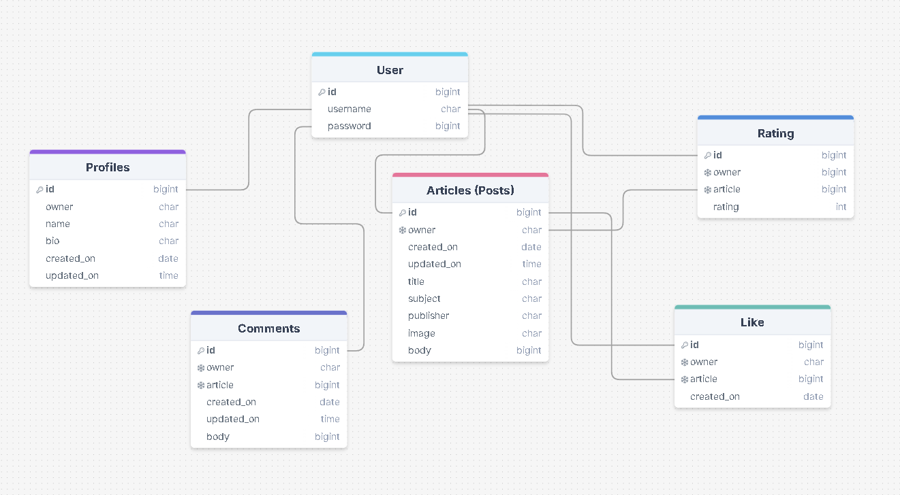

## Testing

### Manual Testing

Rigorous manual testing has been undertaken on every implemented database model, the results of which have been written into the tables below;

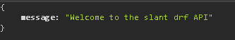

**GENERAL**
| **Test**    | **Action** | **Expected Outcome**  | **Pass/Fail** | **Comments** |
| ----------- | ----------- | ----------- | ----------- | ----------- |
| API loads to root page with custom message | access API through given URL | message displays correctly | PASS
| Admin users can access administrative console for full control over all models & users | log on as an admin user on to admin console & test full CRUD functions over database | admin able to use all expected elements | PASS (Summernote not included)
| All submissions with date & time fields return correct values | upload article, comment, rating | value returned is shown accurately | PASS
| Edits to all models reflected instantley in API view | edit profile, article, comment, rating front-end & observe change in API | data is updated to reflect change | PASS

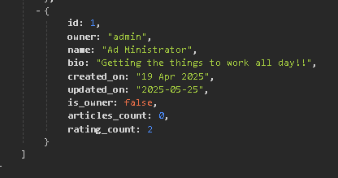

**PROFILE**
| **Test**    | **Action** | **Expected Outcome**  | **Pass/Fail** | **Comments** |
| ----------- | ----------- | ----------- | ----------- | ----------- |
| /profiles displays list of created profiles to the database | input correct URL & observe list | list displays all information | PASS
| /profile/<int> (e.g 1) diplays only the information given for the profile linked to the primary id key | access URL and obeserve returned data | data returned is single profile linked to pk | PASS
| profile users on the front end who utilise edit forms can update data on API | access frontend as auth user & change username, password, bio | change is reflected in API backend | PASS
| Incorrect or invalid profile URL returns relevant error message URL | input non-existent profile int | error message returns successfully | PASS

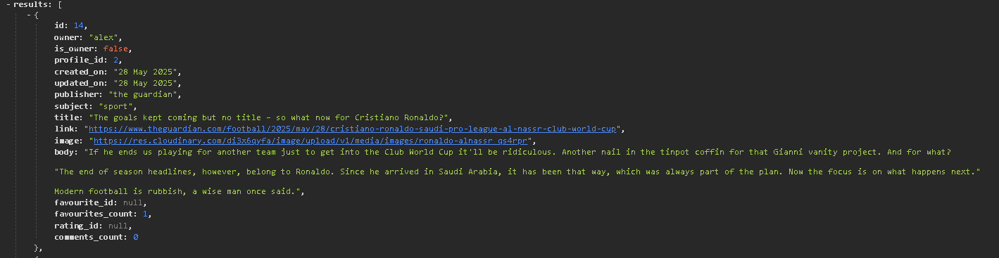

**ARTICLE**
| **Test**    | **Action** | **Expected Outcome**  | **Pass/Fail** | **Comments** |
| ----------- | ----------- | ----------- | ----------- | ----------- |
| /articles displays list of created profiles to the database | input correct URL & observe list | list displays all posted information | PASS
| /article/<int> (e.g 1) diplays only the information given for the article linked to the primary id key | access URL and obeserve returned data | data returned is single article linked to pk | PASS
| article model's charfield choices for subject & publisher are reflected correctly in user uploads | attempt upload frontend using dropdowns | string returned is interpreted by serializer as charfield choice | PASS
| Incorrect or invalid article URL returns relevant error message URL | input non-existent article int | error message returns successfully | PASS
| Favourite count increments with all added favourites added | add extra favourite through frontend | favourite count increments +1 successfully | PASS
| Comment count increments with all added comments added | add extra comment through frontend | comment count increments +1 successfully | PASS

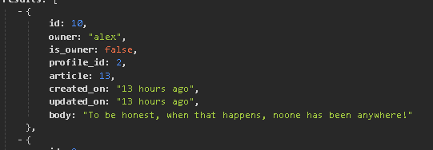

**COMMENT**
| **Test**    | **Action** | **Expected Outcome**  | **Pass/Fail** | **Comments** |
| ----------- | ----------- | ----------- | ----------- | ----------- |
| /comments displays list of created comments to the database | input correct URL & observe list | list displays all posted information | PASS
| /comments/<int> (e.g 1) diplays only the information given for the comment linked to the primary id key & article | access URL and obeserve returned data | data returned is single article linked to pk | PASS

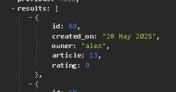

**RATING**
| **Test**    | **Action** | **Expected Outcome**  | **Pass/Fail** | **Comments** |
| ----------- | ----------- | ----------- | ----------- | ----------- |
| /ratings displays list of created ratings to the database | input correct URL & observe list | list displays all posted information | PASS
| /ratings/<int> (e.g 1) diplays only the information given for the rating linked to the primary id key & article | access URL and obeserve returned data | data returned is single article linked to pk | PASS
| /ratings/<int>/rating-stats returns the average value for individual rating to be returned for average rating form | access URL and obeserve returned data | data returned is single rating stats linked to pk | PASS

### Validators

All Python code passed through **[Flake8](https://flake8.pycqa.org/en/latest/)** & **[pycodestyle](https://pypi.org/project/pycodestyle/)** in VScode with no issues;

**pycodestyle**

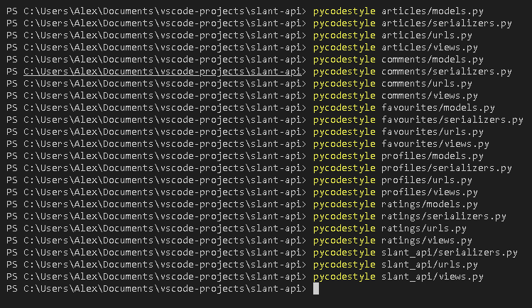

**flake8**

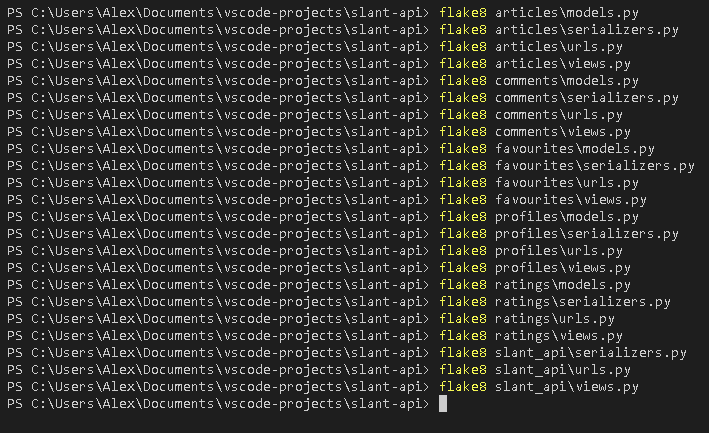

### Manual Testing

**URL PATHS**

URL paths tested both in local production and deployed environments.

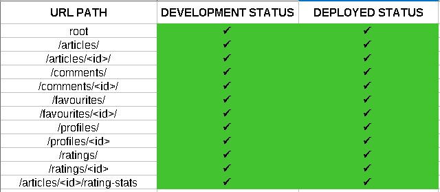

**Search & Filters**

Search and filter functions tested in both local production and deployed environments.

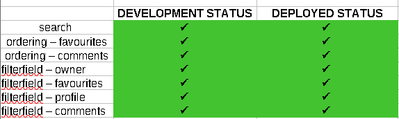

**CRUD**

CRUD table used for reference when manually testing API functionality.

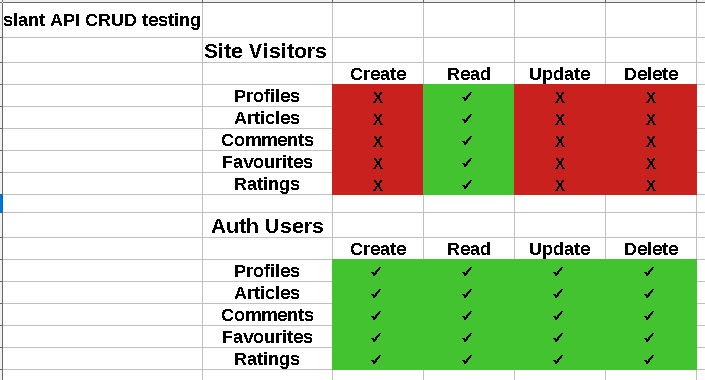

## Security

Security is taken care of by utilising a hidden env.py file which is commited to gitignore to ensure it is never accessible publicly. Three key pieces of secret information are included in the env.py file: Cloudinary URL connection, Django secret key, and postgreSQL database URL. This information has been created as env variables in the settings.py file with references to the generic names deliniated in env.py.

## Bugs

No known bugs at time of deployment.

## Deployment

### Local Deployment

Project was created entirely in VSCode.

Git commands were were grouped into the following commit message categories;

- **"feat"** - feature work
- **"maint"** - maintenance work
- **"docs"** - documentation work

All commands passed through the git commit -m command, and pushed to github with git push.

### Environmental Variables

The deployment process followed is based primarily from Code Institutes 'I Think Therefore I Blog' Walkthrough project.

- Create env.py in root directory of project.
- Add env.py to .gitignore.
- Add DATABASE_URL, SECRET_KEY and CLOUDINARY_URL to env.py.
- Open settings.py in build_mt main project directory.
- Import env.py.
- Add paths for DATABASE_URL, SECRET_KEY and CLOUDINARY_URL.
- Ensure INSTALLED_APPS, MIDDLEWARE, STATICFILES, TEMPLATES are all configured correctly.
- Ensure ALLOWED_HOSTS has .herokuapp in array.
- Run python manage.py collectstatic to pool all staticfiles in correct folder.
- Create Procfile in root directory & initialise gunicorn wsgi.
- Freeze requirements to requirements.txt.
- Turn debug to 'False' in settings.py.

In Heroku;

- Log in or register, then click 'create app'.
- In the new app menu, click on deploy.
- Connect the project to Github by clicking on the deployment method, selecting Github, and locating the repository.
- In the settings tab, add DATABASE_URL, SECRET_KEY and CLOUDINARY_URL as config vars.
- Back in the deploy tab, click deploy branch at the bottom of the page if the correct branch is selected above (main by default).
- View app when the process is complete.

### Forking & Cloning

To fork this repository;

1. On Github, navigate to [the slant-api repository](https://github.com/AlbaXIII/slant-api).
2. In the top-right hand corner of the page, click fork.
3. Choose an owner for the forked repository.
4. Optionally, rename, add a description, and/or copy the default branch only.
5. Click create fork.

To clone this repository;

1. On Github, navigate to [the slant-api repository](https://github.com/AlbaXIII/slant-api).
2. Above the list of files click <> Code.
3. Copy the URL of the repository - you may choose to clone by HTTPS, using a SSH key, or Githubn CLI.
4. Open Git Bash or other IDE.
5. Navigate to your selected working directory.
6. Type git clone, then post the URL.
7. Press enter. 

## TECHNOLOGIES USED

- git (main version control)
- Python 3.12
- Django 4.2
- Django REST Framework 3.16
- Django Allauth 0.50.0
- Django REST Auth 2.2.8
- DjangoCORSheaders  4.5.0
- Gunicorn 23.0.0
- Pillow 11.2.1
- Pyscopg2 2.9.10
- Cloudinary 1.44.0
- Flake8 – 7.2.0

## Credits & Acknowledgements

### Credits

- slant is a project heavily inspired and based on 'moments' - the advanced front end CI module. The API development journey was mapped alongside 'moments' as a guide, and expanded upon where relevant to make slant stand alone.

### Acknowledgements

- As always Dick Vlaanderen, my Code Institute mentor, for being a calm, knowledgeable and reassuring presence.
- My wife Kate for putting up with all my stress!